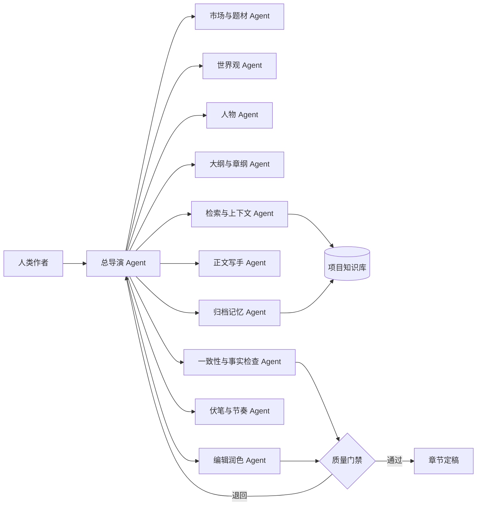
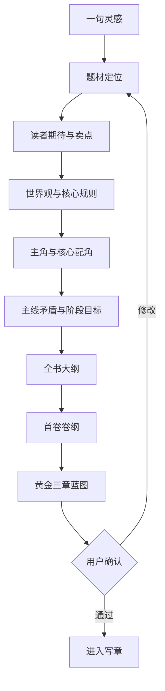
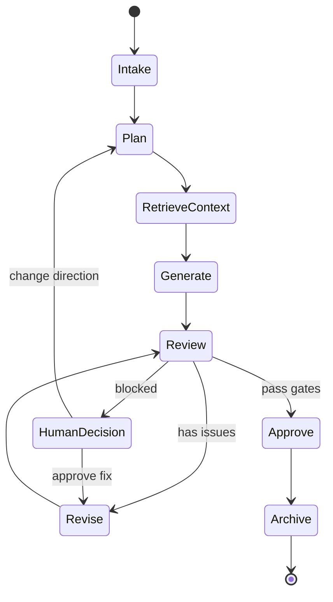

# 小说创作 Agent Team 技术方案

调研日期：2026-06-22

## 1. 结论摘要

建议建设一套“人类主创 + 总导演 Agent + 专项 Agent + 状态记忆系统 + 质量门禁”的小说创作团队。第一阶段不要追求完全自动出书，而是先稳定跑通从创意、设定、大纲、章纲、正文、审稿、修订到归档的闭环。

核心判断：

- 中文小说、网文方向的 Agent Skill 生态更活跃，可重点参考 `oh-story-claudecode`、`awesome-novel-skill`、`AI-Novel-Writing-Assistant`、`tianming-novel-ai-writer`。
- 英文方向高星项目更多是长文本工作流、角色上下文、版本图、写作工具，可作为横向架构参考。
- 小说创作 Agent Team 的关键不是“写得更多”，而是“越写越不断片”：人物、设定、时间线、伏笔、风格和章节目标必须被持续维护。
- MVP 应优先实现本地文件工作区、6 个核心 Agent、章节级工作流、事实快照、质量门禁和 run trace。

## 2. 背景与目标

### 2.1 要解决的问题

| 问题 | 典型表现 | 系统应对 |
| --- | --- | --- |
| 长篇一致性崩坏 | 人物状态、时间线、伏笔、设定越写越散 | 每章状态回写、事实快照、变更声明、冲突检测 |
| 创作链路不完整 | 只会写单段正文，不能稳定从灵感走到章节 | 开书、世界观、人物、大纲、章纲、正文、审稿、归档全流程编排 |
| AI 文味明显 | 句式同质化、情绪空泛、解释过多、节奏平滑 | 文风资产、去 AI 味规则、读者视角审稿、段落级重写 |
| 人机协同断裂 | 作者难以知道 AI 当前依据、进度和下一步 | 可观察运行时、任务卡、章节产物、审批节点、版本分支 |
| 难以复用爆款方法论 | 扫榜、拆文、题材节奏和商业写作技巧停留在人工经验 | 榜单分析、拆文报告、情绪模块库、题材模板和提示词资产化 |

### 2.2 范围边界

本期覆盖：

- 长篇小说与网文连载的结构化生产。
- 短篇故事的题材、反转、情绪和精修流程。
- 多 Agent 协作、项目状态记忆、质量门禁。
- 导入已有草稿并继续写作。
- 支持人类逐步确认和授权自动执行两种模式。

暂不覆盖：

- 完全无人值守的一键百万字出书。
- 版权受限作品的直接仿写或大段复刻。
- 商业发布、签约投稿、平台运营自动化。
- 影视改编、漫画分镜、音频剧生产等衍生链路。
- 模型训练平台和专有数据集建设。

### 2.3 成功标准

1. 用户输入一句灵感后，系统能产出可审阅的题材定位、世界观、主角档案、主线矛盾和首卷大纲。
2. 系统能稳定生成至少 20 章连续正文，并维护角色状态、时间线、伏笔和世界设定。
3. 每章写作有可观察中间产物：章纲、提示词、草稿、审稿意见、修订稿、归档状态。
4. 出现设定冲突、人物失真、伏笔遗忘、节奏异常时，系统能阻断或提示人类确认。
5. 用户可在任意章节回退、改写、分支试写，并保留项目级记忆。

## 3. GitHub 参考项目

### 3.1 重点项目

| 项目 | 定位 | 可借鉴能力 | 优先级 |
| --- | --- | --- | --- |
| [worldwonderer/oh-story-claudecode](https://github.com/worldwonderer/oh-story-claudecode) | 网文/小说写作 skill 包 | 扫榜、拆文、长短篇写作、去 AI 味、封面、多 Agent 审稿 | 高 |
| [ExplosiveCoderflome/AI-Novel-Writing-Assistant](https://github.com/ExplosiveCoderflome/AI-Novel-Writing-Assistant) | AI Native 长篇小说创作系统 | Creative Hub、Agent Runtime、LangGraph、RAG、整本生产主链 | 高 |
| [modoojunko/awesome-novel-skill](https://github.com/modoojunko/awesome-novel-skill) | Claude Code 原生小说 skill | 8 Agent 协作、项目目录、记忆晋升、伏笔和角色状态归档 | 高 |
| [zy-zmc/tianming-novel-ai-writer](https://github.com/zy-zmc/tianming-novel-ai-writer) | 长篇一致性写作系统 | 15 维事实快照、12 类变更声明、6 道生成门禁、每章状态回写 | 高 |
| [RhythmicWave/NovelForge](https://github.com/RhythmicWave/NovelForge) | 结构化 AI 小说创作工具 | JSON Schema、卡片式创作、上下文引用、结构化生成 | 中高 |
| [iLearn-Lab/NovelClaw](https://github.com/iLearn-Lab/NovelClaw) | 长篇写作工作区 | 可观察 run、manuscript/storyboard/memory surfaces、章节级控制 | 中高 |
| [Nigh/show-me-the-story](https://github.com/Nigh/show-me-the-story) | Go 单体小说生成 Web UI | outline、chapter writing、review、foreshadowing、fact check、polish | 中 |
| [SillyTavern/SillyTavern](https://github.com/SillyTavern/SillyTavern) | LLM Power User 前端 | 角色卡、世界书、上下文管理、多人角色交互生态 | 横向参考 |
| [vkbo/novelWriter](https://github.com/vkbo/novelWriter) | 小说写作编辑器 | 小说项目组织、章节/注释/交叉引用、纯文本存储 | 横向参考 |
| [NousResearch/autonovel](https://github.com/NousResearch/autonovel) | 自主小说流水线 | 写作、修订、排版、插图、旁白、evaluate/keep-discard loop | 横向参考 |

### 3.2 借鉴模式抽象

| 模式 | 来源启发 | 本方案落点 |
| --- | --- | --- |
| Skill 化流程 | `oh-story-claudecode`、`awesome-novel-skill` | 每个创作阶段封装为可复用 skill：开书、拆文、写章、审稿、去 AI 味、归档 |
| Agent Runtime | `AI-Novel-Writing-Assistant` | 总导演统一调度工具、子 Agent、审批节点和运行状态 |
| 事实快照 | `tianming-novel-ai-writer` | 章节完成后回写事实状态，而不是依赖模型上下文记忆 |
| 结构化生成 | `NovelForge` | 关键中间产物采用 JSON Schema，便于校验、回放和局部重写 |
| 可观察工作区 | `NovelClaw` | 用户可查看 run、日志、章节文件、任务状态、记忆库和审稿结果 |
| 版本分支图 | `langchain-ai/story-writing` | 章节可产生多个版本，用户选择某个版本继续向后写 |

## 4. 产品定位与设计原则

### 4.1 产品定位

产品不是“AI 写作聊天框”，而是“小说项目操作系统”：它管理故事资产、任务流、上下文、质量门禁和版本演进，让作者可以稳定推进整本书。

面向用户：

- 想从灵感开始完成第一本小说的新手作者。
- 需要日更、续写、精修、拆文辅助的网文作者。
- 需要批量生成设定、章纲、草稿的内容团队。
- 需要把已有草稿导入并维持一致性的作者。

核心价值：

- 把写作拆成可控流程，降低从 0 到 1 的判断成本。
- 把设定、人物、伏笔、时间线从 Prompt 中沉淀成资产。
- 用审稿和门禁约束 AI 输出，避免越写越散。
- 支持人类主导创作方向，AI 承担重复性生产和检查。

### 4.2 设计原则

| 原则 | 解释 | 工程约束 |
| --- | --- | --- |
| 作者主权 | AI 可以建议、执行、质检，但不能吞掉作者决策权 | 关键节点默认需要确认，可切换授权自动模式 |
| 状态优先 | 长篇质量来自持续维护状态，而不是更长 Prompt | 章节完成后必须执行状态回写和冲突检查 |
| 中间产物可见 | 用户应能看到 AI 为什么这样写、下一步做什么 | 所有 run 记录输入、输出、工具调用、评分和错误 |
| 小步闭环 | 按章推进比一次生成整本更稳定 | 先生成章纲，再生成正文，再审稿修订，再归档 |
| 结构化优先 | 设定、人物、伏笔、任务都应机器可读 | 核心资产采用 JSON/YAML/Markdown 双格式存储 |
| 可降级运行 | 多 Agent 不可用时系统仍可单 Agent 运行 | 提供 full、lean、solo 三种执行模式 |

### 4.3 协作模式

| 模式 | 适用场景 | 行为 |
| --- | --- | --- |
| 步步确认 | 首次开书、重要转折、风格探索 | 每个阶段给出候选方案，由用户选择后推进 |
| 半自动 | 日更写作、已有明确大纲 | 低风险任务自动执行，章纲、正文、重大设定变更需确认 |
| 全权执行 | 批量草稿、样章探索、封闭试验 | 总导演按既定策略自动推进，但保留审计日志和回滚点 |

## 5. Agent Team 架构

### 5.1 总体架构



### 5.2 Agent 角色定义

| Agent | 职责 | 输入 | 输出 | 不可做 |
| --- | --- | --- | --- | --- |
| 总导演 Agent | 任务编排、阶段判断、调度子 Agent、处理审批和异常恢复 | 用户目标、项目状态、任务队列 | 执行计划、任务分配、汇总报告 | 不直接写正文，避免职责过宽 |
| 市场与题材 Agent | 扫榜、题材趋势、读者期待、竞品拆解 | 平台、题材、对标作品、榜单数据 | 题材定位、卖点、风险、对标清单 | 不直接复制对标作品表达 |
| 世界观 Agent | 构建世界规则、力量体系、地理、组织、历史和约束 | 题材定位、主线矛盾、用户偏好 | 世界观设定、规则表、禁用冲突清单 | 不随意新增会破坏主线的设定 |
| 人物 Agent | 角色档案、动机、成长弧、关系网、状态更新 | 角色草案、世界观、章节事实 | 角色卡、关系图、状态历史 | 不替换已确认核心人设 |
| 大纲与章纲 Agent | 主线、卷纲、章节蓝图、冲突阶梯和情绪节奏 | 题材、人物、世界观、当前进度 | 全书大纲、卷纲、章纲、场景卡 | 不写最终正文 |
| 检索与上下文 Agent | 选择本章需要的设定、角色、伏笔、文风和参考片段 | 章纲、项目知识库、历史章节 | 上下文包、引用依据、遗漏提示 | 不凭空补设定 |
| 正文写手 Agent | 按章纲和上下文包生成正文草稿 | 章纲、上下文包、文风规则、禁区清单 | 章节草稿、创作说明 | 不绕过质量门禁直接定稿 |
| 编辑润色 Agent | 句式、节奏、对话、画面、去 AI 味、增强爽点或情绪 | 草稿、文风资产、审稿意见 | 修订稿、修改 diff、问题说明 | 不改变已确认剧情事实 |
| 一致性与事实检查 Agent | 检查人物、时间线、设定、道具、地点、因果冲突 | 草稿、事实快照、项目知识库 | 冲突报告、阻断项、修复建议 | 不自动吞掉冲突，应显式报告 |
| 归档记忆 Agent | 章节完成后提取事实、更新状态、归档伏笔和风格反馈 | 定稿、审稿报告、用户反馈 | 事实变更、状态快照、记忆更新 | 不把临时偏好直接晋升为永久记忆 |

### 5.3 执行模式与降级

| 模式 | 子 Agent 数量 | 适用场景 | 降级策略 |
| --- | --- | --- | --- |
| full | 8-10 个 | 正式开书、长篇连载、质量优先 | 关键 Agent 失败则暂停并生成恢复计划 |
| lean | 4-5 个 | MVP、成本受限、短篇创作 | 合并市场/大纲、编辑/质检、记忆/检索角色 |
| solo | 1 个 | 工具不可用、快速试写 | 总导演按固定清单串行执行，并标注质量风险 |

## 6. 运行时与数据模型

### 6.1 项目目录结构

```text
novel-project/
├── project.yaml                  # 项目元信息、目标、模式、当前阶段
├── story.md                      # 项目总索引：题材、主线、卷规划、当前进度
├── settings/
│   ├── genre.yaml                # 题材定位、读者期待、平台规则
│   ├── world.yaml                # 世界观、规则、力量体系、禁区
│   ├── style.md                  # 文风资产、句式偏好、反 AI 规则
│   └── constraints.yaml          # 硬约束和用户偏好
├── characters/
│   ├── index.yaml                # 角色索引和关系摘要
│   └── {character_id}.md         # 单角色档案、动机、成长弧、状态历史
├── outline/
│   ├── global-outline.md         # 全书大纲
│   ├── volume-001.md             # 卷纲
│   └── chapter-blueprints/       # 章节蓝图
├── manuscript/
│   ├── draft/                    # 草稿
│   ├── revised/                  # 修订稿
│   └── final/                    # 定稿
├── tracking/
│   ├── facts.yaml                # 事实快照
│   ├── timeline.yaml             # 时间线
│   ├── foreshadowing.yaml        # 伏笔与回收计划
│   ├── character-state.yaml      # 角色状态
│   └── continuity-issues.yaml    # 冲突和待修复项
├── memory/
│   ├── session.md                # 当前会话短期记忆
│   ├── user-preference.md        # 用户偏好
│   ├── permanent.md              # 晋升后的永久规则
│   └── examples/                 # 正反例片段
├── runs/
│   └── {run_id}/                 # 每次任务的输入、输出、日志、评分
└── references/
    ├── benchmark/                # 拆文报告、榜单分析、对标作品摘要
    └── prompts/                  # 提示词模板和版本
```

### 6.2 核心状态对象

| 对象 | 字段示例 | 更新时机 | 用途 |
| --- | --- | --- | --- |
| `ProjectState` | 阶段、当前卷章、目标字数、协作模式、质量阈值 | 每次 run 开始和结束 | 总导演判断下一步动作 |
| `StoryBible` | 主题、世界观、核心矛盾、主线、结局约束 | 开书、重大变更后 | 保证整本书方向稳定 |
| `CharacterState` | 位置、目标、情绪、伤势、关系、已知信息、秘密 | 每章归档后 | 避免人物状态跳变 |
| `FactSnapshot` | 时间、地点、道具、事件、能力、承诺、已发生事实 | 每章归档后 | 事实一致性检查 |
| `ForeshadowingLedger` | 伏笔、埋设章节、预期回收章节、风险等级 | 写章、审稿、归档 | 避免伏笔遗忘或过密 |
| `StyleProfile` | 句长、对话比例、描写密度、禁用表达、样例片段 | 导入样文、用户反馈、定稿后 | 控制文风和去 AI 味 |
| `RunTrace` | 输入、上下文包、模型、工具调用、输出、评分、错误 | 每次任务 | 可观察、复盘、回滚 |

### 6.3 记忆分层

| 层级 | 内容 | 保留周期 | 晋升规则 |
| --- | --- | --- | --- |
| 短期会话记忆 | 当前对话、临时决策、未归档想法 | 单次会话 | 被用户确认或多次复用后进入项目记忆 |
| 项目记忆 | 设定、人物、章节状态、用户偏好、风格规则 | 整个项目 | 经过归档 Agent 去重压缩 |
| 永久记忆 | 用户稳定偏好、禁用表达、长期写作习惯 | 跨项目 | 同类反馈出现 3 次以上且用户确认 |
| 参考记忆 | 拆文报告、榜单趋势、题材模板、对标节奏 | 按资料版本 | 仅作为参考，不自动覆盖项目设定 |

### 6.4 状态回写协议

每章定稿后必须先归档再进入下一章。没有状态回写的长篇生成，会快速退化成“模型凭印象续写”。

1. 归档 Agent 读取定稿章节，提取新增事实、人物状态变化、伏笔、新道具、地点和时间推进。
2. 一致性 Agent 对比旧快照，生成变更声明：新增、修改、撤销、兑现、冲突、待确认。
3. 总导演根据质量门禁决定自动写入、请求用户确认或回滚到上一版本。
4. 状态写入后生成本章摘要、下一章上下文提示和未完成任务清单。
5. 所有写入操作记录到 run trace，支持后续回放和审计。

### 6.5 章节上下文包

```json
{
  "chapter_id": "ch_021",
  "objective": "主角首次公开反击宗门长老，埋下外门试炼伏笔",
  "must_include": ["上一章冲突后果", "主角伤势未完全恢复", "反派不能提前暴露底牌"],
  "facts": ["主角仍持有残破玉牌", "女主尚不知道主角真实身份"],
  "character_states": ["叶秋：愤怒但克制", "王虎：表面服软，暗中报复"],
  "foreshadowing": ["第 3 章玉牌裂纹", "第 12 章长老偏袒王虎"],
  "style_rules": ["减少解释性总结", "对话带潜台词", "每 800 字至少一个情绪转折"],
  "forbidden": ["不能让主角突然突破", "不能提前揭示玉牌来历"]
}
```

## 7. 核心工作流

### 7.1 开书流程



### 7.2 日更写章流程

| 阶段 | 执行 Agent | 关键产物 | 门禁 |
| --- | --- | --- | --- |
| 任务准备 | 总导演、检索 Agent | 章节目标、上下文包、禁区清单 | 上下文完整性检查 |
| 章纲生成 | 大纲与章纲 Agent | 章节蓝图、场景卡、情绪曲线 | 与卷纲一致性检查 |
| 正文草稿 | 正文写手 Agent | 章节草稿、创作说明 | 硬约束检查 |
| 一致性审查 | 事实检查 Agent | 冲突报告、修复建议 | 阻断项必须修复 |
| 文学编辑 | 编辑润色 Agent | 修订稿、去 AI 味报告 | 文风和节奏评分 |
| 读者视角审稿 | 读者 Agent | 爽点、期待感、可读性反馈 | 低分项进入二次修订 |
| 归档 | 归档记忆 Agent | 事实快照、人物状态、伏笔台账 | 归档通过后才可写下一章 |

### 7.3 导入已有小说流程

1. 导入原文，按章节切分，并生成章节摘要。
2. 抽取角色、关系、时间线、世界观、道具、地点和核心伏笔。
3. 重建项目目录：正文、设定、人物、追踪、参考资料。
4. 生成当前状态快照和续写约束，标记不确定项。
5. 让用户确认关键设定后，进入下一章续写。

### 7.4 拆文与素材库流程

| 拆解对象 | 输出 | 复用方式 |
| --- | --- | --- |
| 黄金三章 | 钩子、危机、爽点、信息差、人物亮相 | 开书和首卷蓝图参考 |
| 章节节奏 | 冲突密度、情绪波峰、结尾钩子 | 章纲 Agent 的节奏模板 |
| 文风 | 句长、对话比例、描写方式、潜台词 | `StyleProfile` 和去 AI 味规则 |
| 人物关系 | 关系网络、权力结构、情感张力 | 人物 Agent 和冲突设计 |
| 商业模块 | 升级、打脸、悬念、反转、追妻、复仇等模块 | 剧情模块库，供章纲组合 |

## 8. 质量门禁与评估体系

### 8.1 门禁分层

| 门禁 | 检查项 | 失败处理 |
| --- | --- | --- |
| Gate 0 输入完整性 | 章纲、上下文包、事实快照、风格规则是否齐全 | 停止写作，要求检索 Agent 补齐 |
| Gate 1 硬约束 | 字数、视角、禁用设定、不能提前揭示的信息 | 自动重写或请求用户确认豁免 |
| Gate 2 连贯性 | 人物状态、时间线、地点、能力、道具、因果 | 阻断定稿，生成冲突修复任务 |
| Gate 3 叙事质量 | 冲突、节奏、情绪波峰、结尾钩子、信息差 | 退回章纲或编辑润色 Agent |
| Gate 4 文风与去 AI 味 | 句式重复、总结腔、空泛形容、解释过多、段落节奏 | 段落级重写并输出 diff |
| Gate 5 归档正确性 | 新增事实、角色变化、伏笔、用户反馈是否正确落库 | 归档失败则禁止进入下一章 |

### 8.2 评分维度

| 维度 | 评分标准 | 建议阈值 |
| --- | --- | --- |
| 一致性 | 事实冲突、人物状态跳变、设定误用数量 | 无 P0/P1 冲突 |
| 推进度 | 本章是否完成章纲目标，是否推动主线或支线 | >= 7/10 |
| 情绪强度 | 读者期待、爽点、紧张、反转或共鸣是否成立 | >= 7/10 |
| 人物可信度 | 动机、行为、台词是否符合人设和当前状态 | >= 8/10 |
| 节奏 | 是否连续平淡、连续高压、信息量过密或拖沓 | >= 7/10 |
| 文风贴合 | 是否符合 `StyleProfile`，是否存在明显 AI 味 | >= 8/10 |

### 8.3 冲突等级

| 等级 | 定义 | 处理策略 |
| --- | --- | --- |
| P0 | 破坏主线、核心人设、世界规则或已发布事实 | 必须阻断，不能自动放行 |
| P1 | 影响章节理解或后续剧情可信度 | 自动修复一次，失败后请求用户确认 |
| P2 | 局部表达不佳、轻微节奏或风格问题 | 编辑 Agent 自动修订 |
| P3 | 优化建议，不影响当前章节成立 | 记录到待优化清单 |

### 8.4 去 AI 味规则

去 AI 味不等于把文字改得口语化，而是降低模板化表达，增强具体动作、真实反应、潜台词、节奏变化和叙事选择。

- 减少抽象总结：将“他感到无比震惊”改为动作、对话和身体反应。
- 减少解释性心理独白：让信息通过冲突、场景和选择暴露。
- 控制句式同质化：长短句交替，避免连续同结构段落。
- 增加潜台词：对话不直接说透，让人物有遮掩、试探、误解和利益。
- 保留瑕疵和棱角：不要把所有冲突都解释得圆滑。
- 使用文风正反例：每次修订引用项目内的 `StyleProfile`。

## 9. 技术选型与工程方案

### 9.1 推荐技术栈

| 层 | 推荐 | 理由 |
| --- | --- | --- |
| 前端 | React + Vite + TanStack Query + 富文本/Markdown 编辑器 | 适合构建写作工作台、任务状态、章节视图和记忆管理界面 |
| 后端 | Node.js/Express 或 Python/FastAPI | Node 适合全栈 TypeScript，Python 适合 LangGraph 和数据处理 |
| Agent 编排 | LangGraph / OpenAI Agents SDK / CrewAI 中择一 | 需要状态图、节点重试、工具调用、人工审批和可恢复执行 |
| 结构化校验 | Zod / Pydantic + JSON Schema | 确保设定、章纲、事实快照可校验 |
| 数据库 | SQLite 起步，PostgreSQL 扩展 | MVP 本地优先，后期多用户和协作再升级 |
| 向量检索 | Qdrant / pgvector | 存储章节摘要、角色片段、文风样例、拆文资料 |
| 文件存储 | Git 友好的 Markdown + YAML + JSON | 便于版本管理、差异审查、人工编辑和导出 |
| 可观察性 | RunTrace + JSONL 日志 + 成本统计 + 失败回放 | 降低多 Agent 黑盒风险 |

### 9.2 Agent Runtime 状态机



### 9.3 服务模块

| 模块 | 职责 | 核心接口 |
| --- | --- | --- |
| Project Service | 项目创建、目录管理、元信息、权限 | `createProject`、`getProjectState`、`updateProjectConfig` |
| Agent Runtime | 任务编排、节点执行、重试、审批、中断恢复 | `startRun`、`resumeRun`、`cancelRun`、`getRunTrace` |
| Context Service | RAG、上下文包构建、引用溯源、token 预算 | `buildContextPack`、`searchMemory`、`summarizeChapter` |
| Writing Service | 章纲、正文、修订、去 AI 味 | `generateBlueprint`、`draftChapter`、`reviseChapter` |
| Quality Service | 事实检查、风格评分、节奏评分、门禁决策 | `runGates`、`scoreChapter`、`detectConflicts` |
| Memory Service | 状态回写、记忆晋升、冲突合并、版本快照 | `archiveChapter`、`updateFacts`、`promoteMemory` |
| Export Service | Markdown、Docx、PDF、在线文档、投稿格式导出 | `exportManuscript`、`publishDoc`、`generatePackage` |

### 9.4 模型策略

- 规划、审稿、冲突分析优先使用推理能力强的模型。
- 正文草稿可使用更高性价比模型，但必须通过质量门禁。
- 风格润色可使用擅长长文本改写的模型，并限制不得改变剧情事实。
- 所有 Agent 支持 OpenAI-compatible API，便于接入 OpenAI、Claude、Gemini、DeepSeek、Kimi 或本地模型。
- 每次 run 记录模型、token、费用、耗时和失败原因，支持按 Agent 优化成本。

### 9.5 MVP 实现建议

| MVP 项 | 必须实现 | 可暂缓 |
| --- | --- | --- |
| 界面 | 项目列表、章节编辑、run 状态、记忆查看 | 多人协作、复杂权限、移动端 |
| Agent | 总导演、章纲、写手、编辑、事实检查、归档 | 扫榜、封面、影视改编 |
| 数据 | Markdown/YAML 文件 + SQLite run 表 | 完整知识图谱、云同步 |
| 质量 | 硬约束、一致性、文风、归档门禁 | 复杂读者模拟、商业化评分模型 |

## 10. 路线图、风险与验收标准

### 10.1 建设路线图

| 阶段 | 周期 | 目标 | 交付物 |
| --- | --- | --- | --- |
| P0 方案验证 | 1-2 周 | 用 CLI 或本地脚本跑通单项目、单章闭环 | 项目目录、6 个核心 Agent、章纲到归档链路、样例小说工程 |
| P1 MVP 工作台 | 3-5 周 | 支持用户创建项目、生成章节、查看状态和编辑记忆 | Web UI、Agent Runtime、SQLite、文件工作区、质量门禁 |
| P2 长篇稳定性 | 5-8 周 | 连续 20-50 章生成与状态维护稳定 | 事实快照、伏笔台账、角色状态、冲突修复、版本分支 |
| P3 创作资产化 | 8-12 周 | 支持拆文、题材模板、文风提取和素材复用 | 拆文工具、题材库、风格库、剧情模块库 |
| P4 产品化 | 12 周以后 | 多项目、协作、云同步、导出发布和成本优化 | 多用户权限、导出服务、监控面板、模型路由策略 |

### 10.2 关键风险

| 风险 | 影响 | 缓解策略 |
| --- | --- | --- |
| Agent 过多导致成本和不稳定性上升 | 运行慢、费用高、失败点多 | MVP 采用 lean 模式，只有关键门禁使用多 Agent |
| 状态回写错误污染后续章节 | 错误会被系统持续引用 | 事实变更声明、用户确认、版本快照、可回滚 |
| RAG 召回不准 | 上下文遗漏或引用无关材料 | 关键词检索 + 向量检索 + 手工锚点 + 引用溯源 |
| 过度模板化 | 所有小说读起来像同一套公式 | 区分题材模板和项目文风，允许作者覆盖规则 |
| 版权和合规问题 | 对标拆文可能越界 | 只抽象结构和方法，不复刻具体表达；保留来源和授权记录 |
| 用户误以为可完全自动出书 | 预期过高，质量不可控 | 产品文案明确“协同创作”，关键节点保留审阅 |

### 10.3 验收指标

| 类别 | 指标 | MVP 阈值 |
| --- | --- | --- |
| 流程 | 从灵感到首章定稿的完整链路成功率 | >= 80% |
| 连续性 | 连续 20 章无 P0/P1 事实冲突 | >= 90% |
| 可观察性 | 每次 run 是否有输入、输出、评分、日志和归档记录 | 100% |
| 编辑效率 | 用户从草稿到可接受定稿的平均轮次 | <= 3 轮 |
| 状态质量 | 章节归档字段完整率 | >= 95% |
| 成本 | 单章生成、审稿、修订、归档总成本 | 可配置预算内，超预算自动提示 |

### 10.4 首期任务拆解

- [ ] 定义项目目录和核心 JSON Schema：`ProjectState`、`StoryBible`、`CharacterState`、`FactSnapshot`、`ChapterBlueprint`、`RunTrace`。
- [ ] 实现总导演 Agent 的状态机：`Intake`、`Plan`、`RetrieveContext`、`Generate`、`Review`、`Revise`、`Approve`、`Archive`。
- [ ] 实现 6 个 MVP Agent：总导演、章纲、正文写手、编辑、一致性检查、归档记忆。
- [ ] 实现文件工作区和 SQLite run 记录，支持每次任务回放。
- [ ] 实现章节上下文包构建：最近章节、角色状态、伏笔、世界观、文风和禁区。
- [ ] 实现 Gate 0-5 的基础检查，并区分 P0-P3 风险。
- [ ] 构建一个样例小说项目，连续生成并归档 5 章作为 MVP 演示。
- [ ] 补充导出能力：Markdown 合集、单章文本、Docx 或 PDF。

### 10.5 推荐落地顺序

1. 先做本地文件制项目，不急于做复杂 Web UI。原因是小说创作的核心难点在状态、门禁和产物协议。
2. 先做 lean 模式，稳定后再拆更多 Agent。原因是过早多 Agent 会放大调度和成本问题。
3. 先保证“写得不断片”，再优化“写得更好”。长篇产品的底座是一致性。
4. 先把用户反馈变成记忆和规则，再追求自动化。否则系统不会越写越懂作者。
5. 先做可观察 run，再做漂亮界面。没有可观察性，多 Agent 出错后很难定位。

## 11. 最终建议

第一版以“本地优先 + 文件工作区 + 6 Agent + 章节闭环 + 状态回写”为 MVP。只要能稳定完成 20 章连续写作并保持事实、人物、伏笔一致，就已经具备继续产品化的基础。

建议首个工程目标是：

> 在一个本地小说项目目录中，通过 BotMux 调度 6 个 Agent，完成从一句灵感到首章定稿、审稿、状态归档的完整闭环，并保留 run trace。
