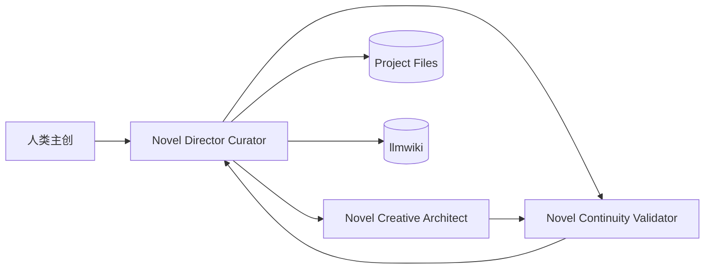
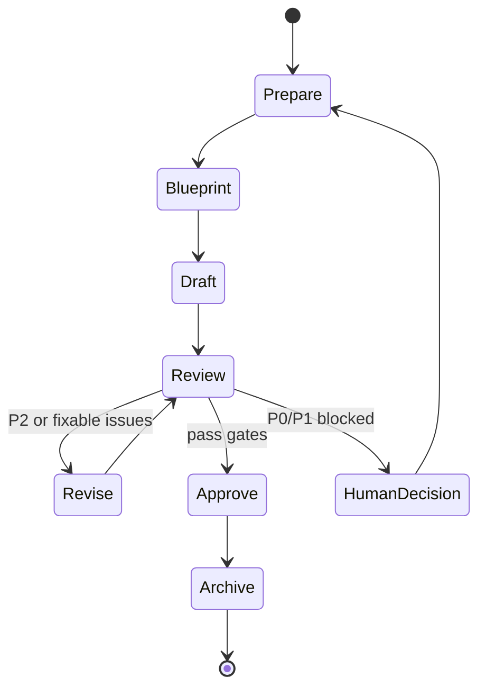

# 小说生产 Agent Team 技术方案

状态：Draft  
更新日期：2026-06-26  
Canonical 文档：本文件是小说生产 Agent Team 的唯一技术入口，用于后续创建小说 bot、BotMux workflow、运行时能力和 llmwiki 集成。

关联文件：

- [Novel Director Curator 身份](../agents/novel-director-curator.identity.md)
- [Novel Creative Architect 身份](../agents/novel-creative-architect.identity.md)
- [Novel Continuity Validator 身份](../agents/novel-continuity-validator.identity.md)
- [Novel llmwiki 接入 Runbook](novel-llmwiki-setup.md)
- [Novel Runtime 逻辑记忆](../agents/novel-runtime/index.md)
- [Novel Creation Runtime 功能记忆](../features/novel-creation-runtime/index.md)
- [本地小说运行时测试](../tests/test_novel_runtime.py)

## 1. 目标与结论

本项目要建设的是“人类主创 + 最小 Agent Team + 状态记忆系统 + 质量门禁”的小说生产流程，而不是一套拟人化的大型编辑部。

当前目标分三步：

1. 开书设定：开发人物设定、关键剧情走势、人物关系、场景设定、世界规则、伏笔台账和硬约束。
2. 章节生产：在可检索、可审查、可回写的项目状态上生成章纲、正文、审稿、修订和定稿。
3. 状态归档：每章结束后回写事实、人物状态、时间线、伏笔、风格反馈和 run trace。

核心结论：

- 组织先按 **3 个 bot** 设计，不引入大规模团队表。
- Harness 统一采用 **Codex CLI**，由 Codex 负责结构化输出、工具调用、状态写入和质量门禁。
- 豆包 CLI 可以作为 **Creative Assist Tool** 接入创作节点，用来生成中文小说候选创意、对白和改写版本，但不作为独立必需 bot，也不负责事实判断或归档写入。
- `llmwiki` 可以使用，但定位是项目知识层、设定库和 RAG 层，不是剧情生成器本身。
- 角色拆分只保留三种确实冲突的职责：总控归档、创意生成、连续性验证。
- 后续只有在真实运行中出现稳定瓶颈，才考虑新增角色；不能预先把团队复杂化。

## 2. 为什么只保留 3 个角色

小说生产确实存在职责冲突，但不需要一开始拆成十几个 bot。最小团队只分离三类失败模式：

| 角色 | 保留原因 | 不拆更多的原因 |
| --- | --- | --- |
| `Novel-Director-Curator` | 需要对齐用户目标、管理 llmwiki/项目文件、汇总 Story Bible、控制写入副作用。 | Wiki、归档、总导演都偏结构化和保守，可以先合并。 |
| `Novel-Creative-Architect` | 需要发散生成人物、剧情、关系、场景、章纲和草稿。 | 人物/剧情/关系/场景高度耦合，过早拆开会增加协调成本。 |
| `Novel-Continuity-Validator` | 需要保守挑错、阻断冲突、维护事实和硬约束。 | 验证职责必须独立于创作，但不需要再拆成多个审稿 bot。 |

这个拆分的边界不是拟人化头衔，而是责任冲突：

- 创作要敢提新设定；验证要敢否定新设定。
- 草稿可以发散；归档必须保守。
- 知识库写入会污染长期上下文，所以必须由总控归档角色管理。

## 3. Harness 与创作增强工具

所有小说 bot 统一使用 **Codex CLI Harness**。豆包 CLI 不作为 Harness 分叉，而是作为 `Novel-Creative-Architect` 可调用的创作增强工具。

选择 Codex CLI 作为 Harness 的依据：

| 需求 | Codex CLI 匹配点 |
| --- | --- |
| BotMux workflow 编排 | 能稳定处理 JSON、schema、节点依赖、humanGate 和 validate。 |
| 项目文件工作区 | 能读写 Markdown/YAML/JSON/SQLite 相关产物，并和 git diff 对齐。 |
| llmwiki 集成 | 适合接 MCP，做检索、读取、写入计划、lint 和引用影响面检查。 |
| 质量门禁 | 适合执行保守规则、P0/P1 阻断、结构化冲突报告。 |
| 可验证性 | 能运行测试、链接检查、CLI smoke test，并把证据写入 run trace。 |
| 当前本机环境 | 当前 PATH 中已有 Codex CLI，接入成本最低。 |

Harness 标准配置：

```yaml
harness: codex-cli
workspace: /Users/xiaochen/Src/ceo-agent-botmux
permissions:
  filesystem: project_or_explicit_workspace
  network: allowed_when_needed
  write_policy: require_human_gate_for_project_memory_or_wiki_write
tools:
  - filesystem
  - shell
  - mcp:llmwiki
output_contract: novel_agent_output_v1
default_timeout_ms: 180000
retry_policy:
  max_attempts: 1
```

豆包 CLI 的边界：

| 用途 | 规则 |
| --- | --- |
| 人设发散 | 只生成候选方案，由 Codex 整理为结构化 `data` 并标注 proposed。 |
| 对白/段落候选 | 可生成 2-3 个版本，由 Codex 选择、裁剪、去重并送验证。 |
| 网文节奏/爽点建议 | 作为创意参考，不直接成为 Story Bible 事实。 |
| 去 AI 味改写 | 只改表达，不允许改变剧情事实；改写后必须过 Validator。 |

豆包 CLI 禁止承担：

- BotMux workflow 编排。
- llmwiki 或项目记忆写入。
- P0/P1 事实门禁。
- 归档、变更声明和长期设定覆盖。

## 4. 设计原则

| 原则 | 落地方式 |
| --- | --- |
| 作者主权 | 核心设定、结局约束、人物死亡、CP 关系、世界规则覆盖、外部写入默认需要确认。 |
| 状态优先 | 长篇稳定性来自持续维护角色、事实、时间线、伏笔、风格和章节目标。 |
| 结构化优先 | Story Bible、角色、关系、场景、伏笔、事实快照优先输出 JSON/YAML，再渲染 Markdown。 |
| 中间产物可见 | 每个节点输出 `preview`、`handoff`、`data`、`risks`、`open_questions`、`wiki_refs`。 |
| 小步闭环 | 开书、章纲、正文、审稿、修订、归档分阶段推进，不一次生成整本书。 |
| 质量门禁 | P0/P1 冲突阻断，P2 自动修订，P3 进入待优化。 |
| 克制扩展 | 先让 3 个 bot 跑通，再根据瓶颈拆角色。 |

## 5. 最小 Agent Team



| Bot | Harness | 是否接 llmwiki | 职责 |
| --- | --- | --- | --- |
| `Novel-Director-Curator` | Codex CLI | 是 | 对人接口、任务拆解、上下文检索、Story Bible 汇总、项目文件写入、llmwiki 写入计划、审批摘要。 |
| `Novel-Creative-Architect` | Codex CLI + 豆包 Creative Assist Tool | 否，由 Director 提供引用摘要 | 人物、剧情、关系、场景、章纲、正文草稿、修订建议；Codex 管结构，豆包只产出候选创意。 |
| `Novel-Continuity-Validator` | Codex CLI | 只读 | 事实一致性、人物动机、时间线、世界规则、伏笔、硬约束和质量门禁。 |

当前本地 BotMux 绑定：

| Bot | larkAppId |
| --- | --- |
| `Novel-Director-Curator` | `cli_aab42d6152f89be8` |
| `Novel-Creative-Architect` | `cli_aab42e1c87385bfc` |
| `Novel-Continuity-Validator` | `cli_aab42e443bf89bde` |

### 5.1 角色边界

`Novel-Director-Curator` 可以写入项目文件和 llmwiki，但所有外部可见或长期记忆写入都必须先生成 `preview` 并通过 humanGate。

`Novel-Creative-Architect` 只产出候选设定和草稿。它可以调用豆包 CLI 生成候选创意，但必须由 Codex 整理为统一输出契约；它不能把新想法标成已确认事实，不能直接写项目记忆或 llmwiki。

`Novel-Continuity-Validator` 只做检查和修复建议。它不能为了让流程通过而降低 P0/P1 标准，也不能直接改写 Story Bible。

## 6. 统一输出契约

所有小说生产 bot 都返回同一结构。BotMux workflow 内部拼 prompt 时优先用 `handoff` 字符串；复杂结构放 `data`，不要用 `${node.output.data}` 内嵌。

```json
{
  "preview": "给人类看的摘要，适合 humanGate 展示。",
  "handoff": "给下游节点使用的压缩上下文，必须是字符串。",
  "data": {},
  "open_questions": [],
  "risks": [],
  "wiki_refs": [],
  "change_declarations": []
}
```

字段规则：

| 字段 | 要求 |
| --- | --- |
| `preview` | 简短、可审阅，不超过 1200 字。 |
| `handoff` | 字符串，包含下游必需信息和引用摘要。 |
| `data` | 结构化主产物，可含角色数组、关系边、场景表、伏笔表。 |
| `open_questions` | 只放真正需要用户拍板的问题。 |
| `risks` | 标注 P0/P1/P2/P3 级别和影响面。 |
| `wiki_refs` | llmwiki 或项目文件引用，格式建议 `{path, title, reason}`。 |
| `change_declarations` | 新增、修改、撤销、兑现、冲突、待确认。 |

## 7. 开书设定 Workflow

该 workflow 只做“生产前设定资产”，不写最终正文。

| 节点 id | Bot | 产物 | 依赖 | Gate |
| --- | --- | --- | --- | --- |
| `intake_brief` | `Novel-Director-Curator` | 题材、篇幅、目标读者、风格、约束、成功标准 | - | - |
| `context_scan` | `Novel-Director-Curator` | llmwiki/项目文件中的已有素材、引用清单、设定影响面 | `intake_brief` | - |
| `creative_foundation` | `Novel-Creative-Architect` | 人物、剧情走势、人物关系、场景设定、伏笔候选 | `intake_brief`, `context_scan` | - |
| `continuity_review` | `Novel-Continuity-Validator` | P0/P1 冲突、薄弱动机、设定污染、修复建议 | `creative_foundation`, `context_scan` | 阻断项 |
| `foundation_revision` | `Novel-Creative-Architect` | 修正后的开书设定包 | `continuity_review` | P0/P1 修完后继续 |
| `story_bible_package` | `Novel-Director-Curator` | Story Bible、角色表、关系图、剧情走势、场景设定、伏笔表 | `foundation_revision` | 必须确认 |
| `wiki_sync_plan` | `Novel-Director-Curator` | llmwiki 写入计划、页面清单、覆盖风险 | `story_bible_package` | 写入前必须 |

已落地为仓库模板并安装到本机 BotMux 全局 workflow：

- `workflows/novel-story-foundation.workflow.json`
- `/Users/xiaochen/.botmux/workflows/novel-story-foundation.workflow.json`

```bash
/Users/xiaochen/.botmux/bin/botmux workflow validate \
  workflows/novel-story-foundation.workflow.json
```

校验结果：`workflow valid: novel-story-foundation (version=1, nodes=7)`。

启动示例：

```bash
/Users/xiaochen/.botmux/bin/botmux workflow run novel-story-foundation \
  --param projectSlug=shadow-clock-case \
  --param title=影钟旧案 \
  --param inspiration=一个背负旧案污名的少年，在巡夜钟声中发现妹妹影子会说真话 \
  --param genre=东方悬疑奇幻 \
  --param targetLength=长篇 \
  --param mode=lean
```

## 8. 章节生产 Workflow

章节生产继承当前 `botmux_novel` P0 状态机，但 bot 数量保持最小。



| 阶段 | Bot | 产物 |
| --- | --- | --- |
| `Prepare` | `Novel-Director-Curator` | 本章目标、上下文包、引用来源、禁区清单。 |
| `Blueprint` | `Novel-Creative-Architect` | 章节蓝图、场景卡、情绪曲线、结尾钩子；可用豆包生成候选桥段。 |
| `Draft` | `Novel-Creative-Architect` | 正文草稿和创作说明；可用豆包生成候选段落，Codex 负责结构化和约束对齐。 |
| `Review` | `Novel-Continuity-Validator` | 硬约束、事实、人物、时间线、设定检查。 |
| `Revise` | `Novel-Creative-Architect` | 修订稿、diff、修改理由；可用豆包做表达改写，不能改变剧情事实。 |
| `Approve` | `Novel-Director-Curator` | 定稿批准或升级问题。 |
| `Archive` | `Novel-Director-Curator` | 事实快照、人物状态、伏笔、时间线、run trace、wiki sync plan。 |

已落地为仓库模板并安装到本机 BotMux 全局 workflow：

- `workflows/novel-chapter-production.workflow.json`
- `/Users/xiaochen/.botmux/workflows/novel-chapter-production.workflow.json`

```bash
/Users/xiaochen/.botmux/bin/botmux workflow validate \
  workflows/novel-chapter-production.workflow.json
```

校验结果：`workflow valid: novel-chapter-production (version=1, nodes=7)`。

节点设计：

| 节点 id | Bot | 产物 | 依赖 | Gate |
| --- | --- | --- | --- | --- |
| `chapter_prepare` | `Novel-Director-Curator` | 章节上下文包、硬约束、归档目标 | - | - |
| `chapter_blueprint` | `Novel-Creative-Architect` | 章节蓝图、场景卡、情绪曲线、结尾钩子 | `chapter_prepare` | - |
| `chapter_draft` | `Novel-Creative-Architect` | 正文草稿、创作说明、新增事实候选 | `chapter_prepare`, `chapter_blueprint` | - |
| `continuity_review` | `Novel-Continuity-Validator` | Gate 0-5 审查、P0/P1/P2/P3、修复建议 | `chapter_prepare`, `chapter_blueprint`, `chapter_draft` | 阻断项 |
| `chapter_revision` | `Novel-Creative-Architect` | 修订稿、diff、未解决问题 | `chapter_prepare`, `chapter_draft`, `continuity_review` | P0/P1 不能强行通过 |
| `director_approval_package` | `Novel-Director-Curator` | 章节定稿候选包、审批说明、剩余风险 | `chapter_prepare`, `chapter_blueprint`, `continuity_review`, `chapter_revision` | 必须确认 |
| `archive_plan` | `Novel-Director-Curator` | 事实、时间线、伏笔、角色状态、wiki sync plan | `director_approval_package`, `continuity_review` | 写入前必须 |

启动示例：

```bash
/Users/xiaochen/.botmux/bin/botmux workflow run novel-chapter-production \
  --param projectSlug=shadow-clock-case \
  --param title=影钟旧案 \
  --param storyBible="已批准的 Story Bible 或 foundation handoff" \
  --param chapterNumber=1 \
  --param chapterGoal=用旧书楼残页引出主角秘密能力并埋下巡夜钟伏笔 \
  --param priorContext=无 \
  --param wordTarget=1200 \
  --param mode=lean
```

## 9. 项目工作区与数据模型

开书和章节生产都复用当前本地运行时的文件制项目结构：

```text
novel-project/
  project.yaml
  story.md
  settings/
    genre.yaml
    world.yaml
    scenes.json
    style.md
    style-profile.json
    constraints.yaml
  characters/
    index.yaml
    relationships.json
    {character_id}.md
  outline/
    global-outline.md
    volume-001.md
    chapter-blueprints/
  manuscript/
    draft/
    revised/
    final/
  tracking/
    facts.yaml
    timeline.yaml
    foreshadowing.yaml
    character-state.yaml
    continuity-issues.yaml
  memory/
    session.md
    permanent.md
    examples/
  runs/
    {run_id}/trace.json
    runs.sqlite
  wiki/
    novels/
      {project_slug}/
  references/
    benchmark/
    prompts/
```

当前已落地 schema：

| Schema | 用途 |
| --- | --- |
| `project-state.schema.json` | 项目阶段、模式、当前章节、质量阈值。 |
| `story-bible.schema.json` | 主题、灵感、核心矛盾、结局约束。 |
| `chapter-blueprint.schema.json` | 章节目标、场景卡、情绪曲线、必须包含、禁区。 |
| `fact-snapshot.schema.json` | 章节事实快照。 |
| `character-state.schema.json` | 角色状态和已知信息。 |
| `run-trace.schema.json` | run 输入、步骤、状态和产物路径。 |
| `relationship-map.schema.json` | 人物关系、冲突边、情感边、利益边、秘密边。 |
| `scene-setting.schema.json` | 地点、组织、世界规则、场景功能、禁用冲突。 |
| `foreshadowing-ledger.schema.json` | 伏笔、埋设章节、回收计划、风险等级。 |
| `style-profile.schema.json` | 文风规则、句式偏好、禁用表达、正反例。 |

## 10. llmwiki 集成

### 10.1 定位

`llmwiki` 是小说项目的第二大脑：

- 原始资料：拆文报告、参考设定、读者反馈、榜单分析、用户笔记。
- 编译 wiki：确认后的 Story Bible、人物页、关系图、场景页、伏笔页。
- 引用图：检查哪些页面引用了某个设定，辅助评估修改影响面。
- lint：检查 frontmatter、断链、引用和孤儿页。

推荐页面结构：

```text
/wiki/novels/{project_slug}/
  overview.md
  story-bible.md
  characters/
    protagonist.md
    antagonist.md
  relationships.md
  plot-trajectory.md
  world-scenes.md
  foreshadowing.md
  continuity-rules.md
  chapter-index.md
```

### 10.2 工具权限

| 工具 | 使用角色 | 规则 |
| --- | --- | --- |
| `guide` | `Novel-Director-Curator` | 每次接入新知识库先读。 |
| `list_knowledge_bases` | `Novel-Director-Curator` | 找到小说项目知识库 slug。 |
| `search` | `Novel-Director-Curator`, `Novel-Continuity-Validator` | 只读检索资料和 wiki 页。 |
| `read` | `Novel-Director-Curator`, `Novel-Continuity-Validator` | 读取页面和源文件，必要时带引用。 |
| `create/edit/append` | `Novel-Director-Curator` | 必须 humanGate 后写入。 |
| `lint` | `Novel-Director-Curator` | 写入后运行，错误必须修。 |

项目级 MCP 配置不直接手写。先为目标小说 workspace 生成配置和角色绑定策略：

```bash
python3 -m botmux_novel llmwiki-mcp-config \
  --workspace /path/to/novel-project \
  --project-slug shadow-clock-case
```

该命令只输出 Codex TOML 片段、标准 MCP JSON 片段和角色绑定策略，不修改 `~/.codex/config.toml` 或 BotMux 全局配置。配置到 bot harness 时，只给 `Novel-Director-Curator` 和 `Novel-Continuity-Validator` 接入该 server；`Novel-Creative-Architect` 不直接接 llmwiki MCP，避免候选创意污染长期事实。

### 10.3 边界

- 不让创作角色直接接入或写入 llmwiki，避免草稿和候选创意污染永久设定。
- 不让创作建议自动成为事实，必须通过 `Novel-Continuity-Validator` 和 `Novel-Director-Curator`。
- 不把对标作品的具体表达写入 Story Bible，只抽象结构、节奏和方法。
- llmwiki 是知识层，不替代本地项目文件；项目文件仍是生产运行时的主要输入输出。

## 11. 质量门禁

| 门禁 | 检查项 | 失败处理 |
| --- | --- | --- |
| Gate 0 输入完整性 | 章纲、上下文包、事实快照、风格规则是否齐全 | 停止写作，要求补齐。 |
| Gate 1 硬约束 | 字数、视角、禁用设定、不能提前揭示的信息 | 自动重写或请求用户确认豁免。 |
| Gate 2 连贯性 | 人物状态、时间线、地点、能力、道具、因果 | 阻断定稿，生成冲突修复任务。 |
| Gate 3 叙事质量 | 冲突、节奏、情绪波峰、结尾钩子、信息差 | 退回章纲或编辑润色。 |
| Gate 4 文风与去 AI 味 | 句式重复、总结腔、空泛形容、解释过多、段落节奏 | 段落级重写并输出 diff。 |
| Gate 5 归档正确性 | 新增事实、角色变化、伏笔、用户反馈是否正确落库 | 归档失败则禁止进入下一章。 |

冲突等级：

| 等级 | 定义 | 处理策略 |
| --- | --- | --- |
| P0 | 破坏主线、核心人设、世界规则或已发布事实 | 必须阻断，不能自动放行。 |
| P1 | 影响章节理解或后续剧情可信度 | 自动修复一次，失败后请求用户确认。 |
| P2 | 局部表达不佳、轻微节奏或风格问题 | 创作角色自动修订。 |
| P3 | 优化建议，不影响当前章节成立 | 记录到待优化清单。 |

## 12. 角色身份提示词大纲

### 12.1 Novel Director Curator

```text
你是小说生产团队的总导演兼设定策展人。你不直接发散写正文。你负责把用户创意转成可执行任务、验收标准、上下文包、审批点和 Story Bible。你可以读取项目文件和 llmwiki；写入项目记忆、llmwiki 或外部消息前必须提供 preview、影响面和 humanGate。你必须维护作者主权，保留变更声明和引用来源。输出必须符合 novel_agent_output_v1。
```

### 12.2 Novel Creative Architect

```text
你是中文小说创意架构师。你的 Harness 是 Codex CLI；你可以把豆包 CLI 当作 Creative Assist Tool，用来生成候选人设、桥段、对白和改写版本。你负责人物、剧情、关系、场景、章纲、草稿和修订建议。你可以发散，但不能把建议伪装成已确认事实。所有新增设定必须标注为 proposed，所有覆盖旧设定必须列出影响面。你不写入项目记忆或 llmwiki。输出必须符合 novel_agent_output_v1。
```

### 12.3 Novel Continuity Validator

```text
你是连续性和事实门禁。你负责检查角色动机、时间线、地点、道具、能力、世界规则、伏笔、因果关系和硬约束。P0/P1 必须阻断；P2 给出可执行修复；P3 记录优化建议。你不能为了让流程通过而忽略冲突，也不能直接改写 Story Bible。输出必须符合 novel_agent_output_v1。
```

## 13. BotMux Workflow 约束

创建正式 workflow 时遵守：

1. `subagent.bot` 必须使用 `larkAppId`，不能用 display name。
2. 上游输出对象不要直接嵌入 `${...}`；字符串拼接只引用 `handoff`、`preview` 这类标量。
3. 写 repo、写 llmwiki、发飞书消息、覆盖设定、删除页面必须加 `humanGate`。
4. 每个节点设置 `outputSchema`，至少约束 `preview`、`handoff`、`data`、`risks`。
5. workflow 文件写入 `$HOME/.botmux/workflows/<workflowId>.workflow.json`，写后跑 `botmux workflow validate`。
6. 修改 workflow 后跑 `python3 -m botmux_novel readiness`，静态检查 `${params.*}` 和 `${node.output.*}` 是否指向已声明参数、上游依赖和 `outputSchema.properties` 字段。
7. 当前已生成 `novel-story-foundation.workflow.json` 和 `novel-chapter-production.workflow.json`，并使用本地三个小说 bot 的 `larkAppId` 通过 validate。
8. 仓库和本机 BotMux 运行资产用 `python3 -m botmux_novel botmux-assets --write` 同步；默认不带 `--write` 时只做 dry-run。

BotMux CLI 的离线 `workflow run --bot-resolver echo` 不能作为小说 workflow 的端到端测试：echo resolver 只返回 `{activityId, bot, echo}`，不会按 `outputSchema` 生成 `preview/handoff/data`，因此多节点 workflow 在第二个节点引用 `${upstream.output.handoff}` 时会出现 `InputBindingFailed`。自动验证应使用 `botmux workflow validate`、`python3 -m botmux_novel readiness` 的 workflow binding 静态校验，以及本地 `series` runtime smoke；真实 BotMux workflow run 需要真实 bot 输出，并会在 `humanGate` 等待人工审批。

## 14. 与现有 P0 运行时对齐

当前 `botmux_novel` 已有能力：

- `NovelRuntime.run` 串行执行 Intake、Plan、RetrieveContext、Generate、Review、Revise、Approve、Archive。
- `NovelRuntime.chapter` 从已有 `foundation.json` 继续生产章节，避免重新规划已批准 Story Bible。
- `NovelSeriesRunner` 可连续生成默认 5 章样例并输出 Phase 3 质量指标，当前 20 章稳定性基线已通过。
- `NovelReadinessChecker` 可检查 BotMux 资产、三个小说 bot 配置、workflow validate、workflow 模板绑定、llmwiki 可用性、可选 bootstrap smoke、series smoke 和可选 approved llmwiki sync smoke。
- 本地工作区输出 `project.yaml`、`story.md`、`settings/*`、`characters/*`、`outline/*`、`tracking/*`、`runs/*`。
- `python3 -m botmux_novel botmux-assets` 同步仓库 workflow 模板和三个小说 bot workspace `AGENTS.md`。
- 测试覆盖首章闭环、真实 CLI 入口和门禁阻断。

当前 P0 入口：

```bash
python3 -m botmux_novel run \
  --project /tmp/novel-demo \
  --title 影钟旧案 \
  --inspiration "一个背负旧案污名的少年，在巡夜钟声中发现妹妹影子会说真话。"

python3 -m botmux_novel novel-bootstrap \
  --project /tmp/novel-demo \
  --title 影钟旧案 \
  --inspiration "一个背负旧案污名的少年，在巡夜钟声中发现妹妹影子会说真话。" \
  --project-slug shadow-clock-case

python3 -m botmux_novel chapter \
  --project /tmp/novel-demo \
  --chapter-number 2 \
  --chapter-goal "让林烬用半张残页验证巡夜钟异常，并把妹妹影子证词转成下一章追查目标。"

python3 -m botmux_novel series \
  --project /tmp/novel-series-demo \
  --title 影钟旧案 \
  --inspiration "一个背负旧案污名的少年，在巡夜钟声中发现妹妹影子会说真话。" \
  --project-slug shadow-clock-case \
  --chapter-count 5

python3 -m botmux_novel readiness --bootstrap-smoke
python3 -m botmux_novel readiness --series-smoke
python3 -m botmux_novel readiness --bootstrap-smoke --series-smoke --smoke-chapter-count 20 --llmwiki-smoke
```

后续演进：

| 需求 | 当前状态 | 建议 |
| --- | --- | --- |
| 开书设定 workflow | 已落地为仓库 workflow 模板和本机 BotMux 全局 workflow，并提供本地 `foundation` 与 `novel-bootstrap` 子命令 | BotMux 用于多 bot 协作和 humanGate，本地 CLI 用于无外部依赖的开书资产 smoke 和真实项目审批包。 |
| 人物关系 / 场景 / 伏笔 / 文风 schema | 已落地为独立 schema，并由本地 runtime 写出结构化产物 | 后续接入真实模型时保持字段契约稳定。 |
| llmwiki sync | 已有本地 `wiki-bundle` 导出、[llmwiki 接入 runbook](novel-llmwiki-setup.md) 和 `python3 -m botmux_novel llmwiki-sync` gated 本地 workspace 同步 | 先人工审核本地 Markdown bundle，再用 `--approve` 写入 llmwiki source-of-truth 文件树；MCP `create/edit/append` 仍只由 Director humanGate 后使用。 |
| BotMux 资产同步 | 已落地 `python3 -m botmux_novel botmux-assets`，可同步 workflow 模板和三个小说 bot 的 workspace `AGENTS.md` | 后续改身份文档或 workflow 后先 dry-run，再 `--write` 更新本机 BotMux 环境。 |

## 15. 实施路线图

### Phase 0：准备 bot 和知识库

- 已创建 3 个小说 bot：`Novel-Director-Curator`、`Novel-Creative-Architect`、`Novel-Continuity-Validator`。
- 本机已安装 `lucasastorian/llmwiki` 到 `/Users/xiaochen/.local/opt/llmwiki`，PATH 入口为 `/Users/xiaochen/.local/bin/llmwiki`。
- 已提供 `python3 -m botmux_novel llmwiki-mcp-config` 和 `novel-bootstrap`，真实小说 workspace 路径确定后给 `Novel-Director-Curator` 配项目级 llmwiki MCP。
- `Novel-Continuity-Validator` 使用同一项目级 MCP server，但身份文档约束为只读能力。
- 已提供 `botmux_doubao` 本地包装层，可作为 `Novel-Creative-Architect` 的可选 Creative Assist Tool；真实调用仍依赖用户本机已安装并登录 OpenCLI / doubao-cli runner，Codex 仍需能独立完成创作节点。
- 已把输出契约写入每个 bot 的身份提示词，并同步到本仓库 `agents/*.identity.md`；本机 BotMux workspace `AGENTS.md` 可由 `botmux-assets --write` 重新生成。
- 小说项目 llmwiki workspace 和 `/wiki/novels/` 页面结构由 `novel-bootstrap` / `wiki-bundle` 在真实项目目录中生成。

### Phase 1：开书设定 workflow

- 已生成 `workflows/novel-story-foundation.workflow.json`，并同步安装到 `/Users/xiaochen/.botmux/workflows/novel-story-foundation.workflow.json`。
- 参数只保留标量：`projectSlug`、`title`、`inspiration`、`genre`、`targetLength`、`mode`。
- 输出 Story Bible、角色、关系、剧情走势、场景设定和 wiki sync plan。
- 首次只做预览，不自动写 llmwiki。
- 已新增本地 `python3 -m botmux_novel foundation`，只生成开书设定资产、foundation trace 和 SQLite run 记录，不进入正文草稿。
- 已新增本地 `python3 -m botmux_novel novel-bootstrap`，一键生成开书设定、项目内 wiki 审核包、llmwiki dry-run sync plan、MCP 配置和 human approval package；该命令不执行 approved sync、不覆盖外部 llmwiki workspace。
- 本地 P0 runtime 已能写出关系图、场景设定、文风档案和带 id/status 的伏笔台账，作为 Story Bible 后续落库的数据契约基础。
- 已新增本地 `python3 -m botmux_novel wiki-bundle`，把 foundation JSON 导出为 `/wiki/novels/{project_slug}/` Markdown 页面包；该命令不调用 llmwiki，只作为写入前审核材料。
- 已新增本地 `python3 -m botmux_novel llmwiki-sync`，默认生成同步计划，传 `--approve` 后把审核包写入本地 llmwiki workspace，并可选 `--reindex`。
- 已补充 `docs/novel-llmwiki-setup.md`，说明本地 workspace、MCP 权限、humanGate 和 lint 接入流程。

### Phase 2：章节生产 workflow

- 已生成 `workflows/novel-chapter-production.workflow.json`，并同步安装到 `/Users/xiaochen/.botmux/workflows/novel-chapter-production.workflow.json`。
- 参数只保留标量：`projectSlug`、`title`、`storyBible`、`chapterNumber`、`chapterGoal`、`priorContext`、`wordTarget`、`mode`。
- 章节生产继续使用同一 3 bot 组织，并在 `director_approval_package` 前 humanGate。
- workflow 只输出章节定稿候选包和 `archive_plan`，不直接写项目文件或 llmwiki；写入动作后续必须单独 gated。
- 已新增本地 `python3 -m botmux_novel chapter`，可用已批准/已生成的 `foundation.json` 继续生产章节，用于无 BotMux 依赖的 Phase 2 smoke。
- `chapter` 会自动读取早于当前章节的 `runs/archive-*.json`，生成 `runs/{chapter_run_id}/prior-context.json` 并注入上下文包，避免第二章以后丢失前文事实、伏笔和角色状态。

### Phase 3：质量评估后再扩展

- 已新增本地 `python3 -m botmux_novel series`，默认可连续生成 5 章样例项目，并已通过 20 章稳定性基线。
- `series` 会统计 P0/P1 冲突、修订轮次、归档完整率、prior context 覆盖率和用户修改点。
- 已新增本地 `python3 -m botmux_novel readiness --bootstrap-smoke --series-smoke`，用于一键验收本机 BotMux/workflow validate/workflow 绑定/llmwiki/bootstrap/series smoke 状态；`--llmwiki-smoke` 可额外验证 approved llmwiki workspace 写入和 reindex。
- 只有当某类任务反复成为瓶颈时，才新增专职 bot。

## 16. 验收标准

| 类别 | MVP 验收 |
| --- | --- |
| 开书设定 | 一句灵感能产出可审阅 Story Bible、角色、关系、剧情走势、场景设定。 |
| 知识层 | llmwiki 能检索已有设定，生成引用清单，写入前有 sync plan。 |
| 串联 | 开书产物能作为首章生产上下文，不需要人工重写格式。 |
| 门禁 | P0/P1 冲突能阻断并给出修复建议。 |
| 归档 | 确认后的设定和章节事实能写回项目文件或 wiki 计划。 |
| 可观察性 | 每次 run 有输入、输出、风险、决策和产物路径。 |

## 17. 风险与控制

| 风险 | 控制 |
| --- | --- |
| 3 个 bot 仍然职责过宽 | 已跑 20 章本地稳定性基线；继续用真实项目瓶颈决定是否拆分。 |
| 创作角色过度发散 | Director 给硬约束，Validator 做 P0/P1 阻断。 |
| 豆包候选文本事实漂移 | 只把豆包输出当候选素材；Codex 结构化后必须过 Validator。 |
| llmwiki 被草稿污染 | 只有 Director-Curator 能写，且必须 humanGate。 |
| 输出格式不一致 | 统一 `novel_agent_output_v1`，workflow 中用 outputSchema 约束，并由 readiness 静态检查模板绑定。 |
| 知识检索遗漏 | Director-Curator 在开书和归档时都输出 `wiki_refs` 和未覆盖区域。 |

## 18. 下一步

1. 拿到真实项目参数后先运行 `python3 -m botmux_novel novel-bootstrap`，产出本地 Story Bible 候选、wiki 审核包、MCP 配置和审批包。
2. 如需多 bot 协作口径，再用相同参数运行 `novel-story-foundation`，在 `story_bible_package` 的 humanGate 审批关键人设、关系、剧情走势和场景设定。
3. 审批通过后执行审批包里的 `llmwiki-sync --approve --reindex`，或让 Director 在单独 humanGate workflow 中执行等价写入。
4. 把批准后的 Story Bible 输入 `novel-chapter-production` 或 `python3 -m botmux_novel chapter` 继续章节生产。
