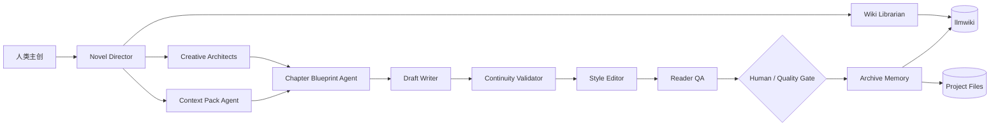
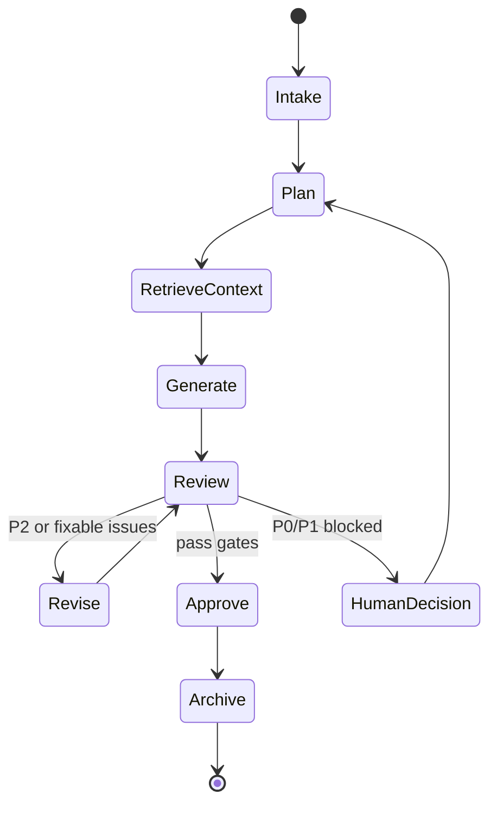

# 小说生产 Agent Team 技术方案

状态：Draft  
更新日期：2026-06-26  
Canonical 文档：本文件合并了早期小说创作调研方案和 Harness 方案，作为后续创建小说 bot、BotMux workflow、运行时能力和 llmwiki 集成的唯一技术入口。

关联文件：

- [Novel Runtime 逻辑记忆](../agents/novel-runtime/index.md)
- [Novel Creation Runtime 功能记忆](../features/novel-creation-runtime/index.md)
- [本地小说运行时测试](../tests/test_novel_runtime.py)

## 1. 目标与结论

本项目要建设的是“人类主创 + 总导演 Agent + 专项创作 Agent + 状态记忆系统 + 质量门禁”的小说生产团队，而不是单纯的 AI 写作聊天框。

当前目标分三步：

1. 开书设定：先开发人物设定、关键剧情走势、人物关系、场景设定、世界规则、伏笔台账和硬约束。
2. 章节生产：在可检索、可审查、可回写的项目状态上生成章纲、正文、审稿、修订和定稿。
3. 状态归档：每章结束后回写事实、人物状态、时间线、伏笔、风格反馈和 run trace。

核心结论：

- `llmwiki` 可以使用，但定位是项目知识层、设定库和 RAG 层，不是剧情生成器本身。
- 小说生产团队不能只拆“创意生成”角色，还必须保留总导演、上下文、质量门禁和归档记忆角色。
- MVP 先建 5 个小说 bot：`Director`、`Wiki-Librarian`、`Creative-Architect`、`Continuity-Validator`、`Bible-Curator`。稳定后再拆 Full Team。
- Codex CLI 更适合结构化编排、文件工作区、schema、trace、MCP、llmwiki 和质量门禁。
- 豆包 CLI 更适合中文创意发散、网文语感、正文草稿、对话和润色。
- Trae CLI 更适合工程实现、工作台、前端、可视化和工具适配，不建议作为核心文学生成 Harness。

## 2. 范围

本期覆盖：

- 长篇小说与网文连载的结构化生产。
- 从灵感到 Story Bible、角色、关系、场景、剧情走势的开书设定流程。
- 从章纲到正文、审稿、修订、定稿、归档的章节生产流程。
- 项目文件工作区、结构化 schema、质量门禁、状态回写和 run trace。
- llmwiki 作为资料库、设定库和引用图的集成边界。
- Codex CLI、豆包 CLI、Trae CLI 三类 Harness 的角色分工。

暂不覆盖：

- 完全无人值守的一键百万字出书。
- 版权受限作品的直接仿写或大段复刻。
- 商业发布、签约投稿、平台运营自动化。
- 影视改编、漫画分镜、音频剧生产等衍生链路。
- 模型训练平台和专有数据集建设。

## 3. 设计原则

| 原则 | 落地方式 |
| --- | --- |
| 作者主权 | 核心设定、结局约束、人物死亡、CP 关系、世界规则覆盖、外部写入默认需要确认。 |
| 状态优先 | 长篇稳定性来自持续维护角色、事实、时间线、伏笔、风格和章节目标，而不是更长 prompt。 |
| 结构化优先 | Story Bible、角色、关系、场景、伏笔、事实快照优先输出 JSON/YAML，再渲染 Markdown。 |
| 中间产物可见 | 每个节点输出 `preview`、`handoff`、`data`、`risks`、`open_questions`、`wiki_refs`。 |
| 小步闭环 | 开书、章纲、正文、审稿、修订、归档分阶段推进，不一次生成整本书。 |
| 质量门禁 | P0/P1 冲突阻断，P2 自动修订，P3 进入待优化。 |
| 可降级运行 | full/lean/solo 三档：多 bot 不可用时仍可由少量 bot 串行执行。 |

## 4. 借鉴模式

早期调研的项目清单不再在本文逐项展开，后续设计只保留对本项目有直接价值的模式：

| 模式 | 来源启发 | 本项目落点 |
| --- | --- | --- |
| Skill 化流程 | `oh-story-claudecode`、`awesome-novel-skill` | 开书、拆文、写章、审稿、去 AI 味、归档拆成可复用节点。 |
| Agent Runtime | `AI-Novel-Writing-Assistant` | 总导演统一调度子 Agent、审批节点和运行状态。 |
| 事实快照 | `tianming-novel-ai-writer` | 每章结束后回写事实状态，而不是依赖模型上下文记忆。 |
| 结构化生成 | `NovelForge` | 核心中间产物采用 JSON Schema，便于校验、回放和局部重写。 |
| 可观察工作区 | `NovelClaw` | run、日志、章节文件、任务状态、记忆库和审稿结果可追踪。 |
| 版本分支图 | `langchain-ai/story-writing` | 章节可产生多个版本，用户选择某个版本继续向后写。 |

## 5. 总体架构



### 5.1 三层职责

| 层 | 角色 | 职责 |
| --- | --- | --- |
| 决策层 | `Novel-Director-Agent` | 对人接口、目标澄清、任务拆解、冲突升级、产物汇总。 |
| 创作层 | 人物、剧情、关系、世界/场景、章纲、写手、编辑 | 负责设定和文本生产，但不能绕过质量门禁。 |
| 状态层 | Wiki、Context、Continuity、Archive、Bible Curator | 负责资料检索、上下文包、冲突检查、事实回写、知识库同步。 |

## 6. Agent Team

### 6.1 MVP Team

先建 5 个 bot，降低 BotMux 身份配置和调度复杂度：

| Bot | Harness 推荐 | 是否接 llmwiki | 覆盖角色 |
| --- | --- | --- | --- |
| `Novel-Director-Agent` | Codex CLI | 可选 | 总导演、任务拆解、汇总、humanGate 决策草案。 |
| `Novel-Wiki-Librarian` | Codex CLI | 必须 | llmwiki 检索、读取、引用图、资料上下文。 |
| `Novel-Creative-Architect` | 豆包 CLI | 可选只读 | 合并人物、剧情、关系、场景设定。 |
| `Novel-Continuity-Validator` | Codex CLI | 可选只读 | 一致性、事实、设定污染、硬约束检查。 |
| `Novel-Bible-Curator` | Codex CLI | 建议 | Story Bible 汇总、项目文件和 llmwiki 写入计划。 |

### 6.2 Full Team

MVP 稳定后，再按质量瓶颈拆成专职 bot：

| Bot | 主 Harness | 备选 Harness | 是否接 llmwiki | 主要输出 |
| --- | --- | --- | --- | --- |
| `Novel-Director-Agent` | Codex CLI | Trae CLI | 可选 | 执行计划、审批摘要、冲突决策包。 |
| `Novel-Market-Genre-Agent` | 豆包 CLI | Codex CLI | 只读 | 题材定位、读者期待、卖点、平台禁区。 |
| `Novel-Wiki-Librarian` | Codex CLI | Trae CLI | 必须 | 资料检索、引用清单、已有设定影响面。 |
| `Novel-Character-Architect` | 豆包 CLI | Codex CLI | 只读 | 角色卡、动机、成长弧、秘密、状态初稿。 |
| `Novel-Plot-Architect` | 豆包 CLI | Codex CLI | 只读 | 主线、卷级走势、关键转折、伏笔回收。 |
| `Novel-Relationship-Architect` | 豆包 CLI | Codex CLI | 只读 | 人物关系网、冲突边、情感边、利益边、秘密边。 |
| `Novel-World-Scene-Architect` | 豆包 CLI | Codex CLI | 只读 | 世界规则、地点功能、组织、核心场景。 |
| `Novel-Context-Pack-Agent` | Codex CLI | Trae CLI | 只读 | 章节上下文包、source refs、禁区清单。 |
| `Novel-Chapter-Blueprint-Agent` | Codex CLI | 豆包 CLI | 只读 | 章节目标、场景卡、情绪曲线、钩子。 |
| `Novel-Draft-Writer-Agent` | 豆包 CLI | Codex CLI | 不建议 | 正文草稿、创作说明。 |
| `Novel-Style-Editor-Agent` | 豆包 CLI | Codex CLI | 不建议 | 去 AI 味修订、文风 diff、节奏增强。 |
| `Novel-Continuity-Validator` | Codex CLI | Trae CLI | 只读 | P0/P1/P2/P3 问题、修复建议、门禁结果。 |
| `Novel-Reader-QA-Agent` | 豆包 CLI | Codex CLI | 只读 | 爽点、期待感、阅读阻滞、商业可读性反馈。 |
| `Novel-Archive-Memory-Agent` | Codex CLI | Trae CLI | 建议 | 事实快照、时间线、伏笔、角色状态、run trace。 |
| `Novel-Bible-Curator` | Codex CLI | Trae CLI | 建议 | Story Bible、wiki sync、lint 修复计划。 |

## 7. Harness 设计

Harness 是 bot 的执行外壳，负责提供 CLI 入口、模型能力、身份提示词、工具权限、工作区、输出契约、timeout、retry、日志和失败恢复策略。

当前本机环境只检测到 Codex CLI 在 PATH 中；豆包 CLI 和 Trae CLI 需要在创建对应 bot 时补充安装、PATH、鉴权和 BotMux 启动配置。本文对豆包/Trae 的分工是角色设计建议，实际接入前以本机 CLI 能力和可用工具为准。

### 7.1 Codex CLI Harness

适合：

- 结构化编排、repo 文件读写、schema、测试、trace。
- llmwiki MCP 操作和文档/Markdown 维护。
- 质量门禁、事实比对、上下文包构建。
- BotMux workflow JSON 生成和 validate。

建议配置：

```yaml
harness: codex-cli
workspace: /Users/xiaochen/Src/ceo-agent-botmux
permissions:
  filesystem: project_or_explicit_workspace
  network: allowed_when_needed
  write_policy: require_human_gate_for_project_memory_or_wiki_write
tools:
  - filesystem
  - shell
  - mcp:llmwiki
output_contract: novel_agent_output_v1
default_timeout_ms: 180000
retry_policy:
  max_attempts: 1
```

### 7.2 豆包 CLI Harness

适合：

- 中文小说创意发散、人物口吻、网文节奏、正文草稿。
- 情绪曲线、爽点、对话潜台词、去 AI 味改写。
- 读者视角反馈和商业可读性评估。

不适合默认承担 repo 写入、schema/lint/trace 的唯一来源、关键事实覆盖和知识库写入。

建议配置：

```yaml
harness: doubao-cli
workspace: ephemeral_or_project_readonly
permissions:
  filesystem: readonly_unless_explicit
  network: disabled_by_default
tools:
  - prompt_only
  - optional_mcp_readonly:llmwiki
output_contract: novel_agent_output_v1
default_timeout_ms: 240000
retry_policy:
  max_attempts: 1
```

### 7.3 Trae CLI Harness

适合：

- 小说工作台、前端、可视化关系图、adapter、工程化工具。
- 运行时集成、UI 流程、脚手架、辅助脚本。
- 当 Codex CLI 不可用时，承担结构化工程任务的备选。

不建议默认承担长篇中文正文主笔、唯一质量门禁或无审批知识库写入。

建议配置：

```yaml
harness: trae-cli
workspace: /Users/xiaochen/Src/ceo-agent-botmux
permissions:
  filesystem: project_scoped
  network: allowed_when_needed
tools:
  - filesystem
  - shell
  - optional_mcp:llmwiki
output_contract: novel_agent_output_v1
default_timeout_ms: 180000
retry_policy:
  max_attempts: 1
```

## 8. 统一输出契约

所有小说生产 bot 都应返回同一结构。BotMux workflow 内部拼 prompt 时优先用 `handoff` 字符串；复杂结构放 `data`，不要用 `${node.output.data}` 内嵌。

```json
{
  "preview": "给人类看的摘要，适合 humanGate 展示。",
  "handoff": "给下游节点使用的压缩上下文，必须是字符串。",
  "data": {},
  "open_questions": [],
  "risks": [],
  "wiki_refs": [],
  "change_declarations": []
}
```

字段规则：

| 字段 | 要求 |
| --- | --- |
| `preview` | 简短、可审阅，不超过 1200 字。 |
| `handoff` | 字符串，包含下游必需信息和引用摘要。 |
| `data` | 结构化主产物，可含角色数组、关系边、场景表、伏笔表。 |
| `open_questions` | 只放真正需要用户拍板的问题。 |
| `risks` | 标注 P0/P1/P2/P3 级别和影响面。 |
| `wiki_refs` | llmwiki 或项目文件引用，格式建议 `{path, title, reason}`。 |
| `change_declarations` | 新增、修改、撤销、兑现、冲突、待确认。 |

## 9. 开书设定 Workflow

该 workflow 只做“生产前设定资产”，不写正文。

| 节点 id | 推荐 Bot | 产物 | 依赖 | Gate |
| --- | --- | --- | --- | --- |
| `intake_brief` | `Novel-Director-Agent` | 题材、篇幅、目标读者、风格、约束、成功标准 | - | 可选 |
| `wiki_context_scan` | `Novel-Wiki-Librarian` | llmwiki/项目文件中的已有素材、引用清单、设定影响面 | `intake_brief` | - |
| `market_genre_lens` | `Novel-Market-Genre-Agent` 或 MVP 的 `Creative-Architect` | 题材定位、读者期待、卖点和禁区 | `intake_brief`, `wiki_context_scan` | - |
| `story_bible_seed` | `Novel-Director-Agent` | 主题、核心矛盾、主线承诺、结局约束 | 前三者 | 关键项确认 |
| `character_foundation` | `Novel-Character-Architect` | 主角、核心配角、反派、动机、秘密、成长弧 | `story_bible_seed` | - |
| `plot_trajectory` | `Novel-Plot-Architect` | 卷级走势、关键转折、伏笔埋设与回收 | `story_bible_seed`, `character_foundation` | - |
| `relationship_map` | `Novel-Relationship-Architect` | 人物关系图、冲突边、情感边、利益边、秘密边 | `character_foundation`, `plot_trajectory` | - |
| `world_scene_foundation` | `Novel-World-Scene-Architect` | 世界规则、组织、地点功能、核心场景、禁用设定 | `story_bible_seed`, `plot_trajectory` | - |
| `cross_consistency_review` | `Novel-Continuity-Validator` | P0/P1 冲突、薄弱动机、设定污染、修复建议 | 前面全部 | 阻断项 |
| `foundation_revision` | `Novel-Director-Agent` + 创作 bot | 修正后的开书设定包 | `cross_consistency_review` | P0/P1 修完后继续 |
| `story_bible_package` | `Novel-Bible-Curator` | Story Bible、角色表、关系图、剧情走势、场景设定、伏笔表 | `foundation_revision` | 必须确认 |
| `wiki_sync_plan` | `Novel-Bible-Curator` | llmwiki 写入计划、页面清单、覆盖风险 | `story_bible_package` | 写入前必须 |

## 10. 章节生产 Workflow

章节生产继承当前 `botmux_novel` P0 状态机：



| 阶段 | 推荐 Bot | Harness | 产物 |
| --- | --- | --- | --- |
| `Intake` | `Novel-Director-Agent` | Codex CLI | 本章目标、授权模式、质量阈值。 |
| `RetrieveContext` | `Novel-Context-Pack-Agent` | Codex CLI | 章节上下文包、source refs、禁区。 |
| `Plan` | `Novel-Chapter-Blueprint-Agent` | Codex CLI | 章节蓝图、场景卡、情绪曲线。 |
| `Generate` | `Novel-Draft-Writer-Agent` | 豆包 CLI | 正文草稿和创作说明。 |
| `Review` | `Novel-Continuity-Validator` | Codex CLI | 硬约束、事实、人物、时间线、设定检查。 |
| `Revise` | `Novel-Style-Editor-Agent` | 豆包 CLI | 去 AI 味修订稿、diff、修改理由。 |
| `ReaderQA` | `Novel-Reader-QA-Agent` | 豆包 CLI | 爽点、期待感、阅读阻滞反馈。 |
| `Approve` | `Novel-Director-Agent` | Codex CLI | 定稿批准或升级问题。 |
| `Archive` | `Novel-Archive-Memory-Agent` | Codex CLI | 事实快照、人物状态、伏笔、时间线、run trace。 |

## 11. 项目工作区与数据模型

开书和章节生产都应复用当前本地运行时的文件制项目结构：

```text
novel-project/
  project.yaml
  story.md
  settings/
    genre.yaml
    world.yaml
    style.md
    constraints.yaml
  characters/
    index.yaml
    {character_id}.md
  outline/
    global-outline.md
    volume-001.md
    chapter-blueprints/
  manuscript/
    draft/
    revised/
    final/
  tracking/
    facts.yaml
    timeline.yaml
    foreshadowing.yaml
    character-state.yaml
    continuity-issues.yaml
  memory/
    session.md
    permanent.md
    examples/
  runs/
    {run_id}/trace.json
    runs.sqlite
  references/
    benchmark/
    prompts/
```

当前已落地 schema：

| Schema | 用途 |
| --- | --- |
| `project-state.schema.json` | 项目阶段、模式、当前章节、质量阈值。 |
| `story-bible.schema.json` | 主题、灵感、核心矛盾、结局约束。 |
| `chapter-blueprint.schema.json` | 章节目标、场景卡、情绪曲线、必须包含、禁区。 |
| `fact-snapshot.schema.json` | 章节事实快照。 |
| `character-state.schema.json` | 角色状态和已知信息。 |
| `run-trace.schema.json` | run 输入、步骤、状态和产物路径。 |

建议新增 schema：

| Schema | 用途 |
| --- | --- |
| `relationship-map.schema.json` | 人物关系、冲突边、情感边、利益边、秘密边。 |
| `scene-setting.schema.json` | 地点、组织、世界规则、场景功能、禁用冲突。 |
| `foreshadowing-ledger.schema.json` | 伏笔、埋设章节、回收计划、风险等级。 |
| `style-profile.schema.json` | 文风规则、句式偏好、禁用表达、正反例。 |

## 12. llmwiki 集成

### 12.1 定位

`llmwiki` 是小说项目的第二大脑：

- 原始资料：拆文报告、参考设定、读者反馈、榜单分析、用户笔记。
- 编译 wiki：确认后的 Story Bible、人物页、关系图、场景页、伏笔页。
- 引用图：检查哪些页面引用了某个设定，辅助评估修改影响面。
- lint：检查 frontmatter、断链、引用和孤儿页。

推荐页面结构：

```text
/wiki/novels/{project_slug}/
  overview.md
  story-bible.md
  characters/
    protagonist.md
    antagonist.md
  relationships.md
  plot-trajectory.md
  world-scenes.md
  foreshadowing.md
  continuity-rules.md
  chapter-index.md
```

### 12.2 工具权限

| 工具 | 使用角色 | 规则 |
| --- | --- | --- |
| `guide` | `Wiki-Librarian`, `Bible-Curator` | 每次接入新知识库先读。 |
| `list_knowledge_bases` | `Wiki-Librarian` | 找到小说项目知识库 slug。 |
| `search` | `Wiki-Librarian`, `Context-Pack-Agent` | 只读检索资料和 wiki 页。 |
| `read` | `Wiki-Librarian`, `Context-Pack-Agent` | 读取页面和源文件，必要时带引用。 |
| `create/edit/append` | `Bible-Curator`, `Archive-Memory-Agent` | 必须 humanGate 后写入。 |
| `lint` | `Bible-Curator`, `Archive-Memory-Agent` | 写入后运行，错误必须修。 |

### 12.3 边界

- 不让正文写手直接写 llmwiki，避免草稿污染永久设定。
- 不让创作建议自动成为事实，必须通过 `Continuity-Validator` 和 `Director`。
- 不把对标作品的具体表达写入 Story Bible，只抽象结构、节奏和方法。
- llmwiki 是知识层，不替代本地项目文件；项目文件仍是生产运行时的主要输入输出。

## 13. 质量门禁

| 门禁 | 检查项 | 失败处理 |
| --- | --- | --- |
| Gate 0 输入完整性 | 章纲、上下文包、事实快照、风格规则是否齐全 | 停止写作，要求补齐。 |
| Gate 1 硬约束 | 字数、视角、禁用设定、不能提前揭示的信息 | 自动重写或请求用户确认豁免。 |
| Gate 2 连贯性 | 人物状态、时间线、地点、能力、道具、因果 | 阻断定稿，生成冲突修复任务。 |
| Gate 3 叙事质量 | 冲突、节奏、情绪波峰、结尾钩子、信息差 | 退回章纲或编辑润色 Agent。 |
| Gate 4 文风与去 AI 味 | 句式重复、总结腔、空泛形容、解释过多、段落节奏 | 段落级重写并输出 diff。 |
| Gate 5 归档正确性 | 新增事实、角色变化、伏笔、用户反馈是否正确落库 | 归档失败则禁止进入下一章。 |

冲突等级：

| 等级 | 定义 | 处理策略 |
| --- | --- | --- |
| P0 | 破坏主线、核心人设、世界规则或已发布事实 | 必须阻断，不能自动放行。 |
| P1 | 影响章节理解或后续剧情可信度 | 自动修复一次，失败后请求用户确认。 |
| P2 | 局部表达不佳、轻微节奏或风格问题 | 编辑 Agent 自动修订。 |
| P3 | 优化建议，不影响当前章节成立 | 记录到待优化清单。 |

## 14. 角色身份提示词大纲

### 14.1 Novel Director

```text
你是小说生产团队的总导演。你不直接写正文。你负责把用户创意转成可执行的创作任务、验收标准、风险和审批点。你必须维护作者主权；关键设定变更、结局约束、人物死亡、世界规则覆盖、外部写入都要升级确认。输出必须符合 novel_agent_output_v1。
```

### 14.2 Wiki Librarian

```text
你是小说项目知识管理员。你负责通过 llmwiki 和项目文件查找已有设定、参考资料、拆文笔记和用户偏好，输出可引用的上下文。你只读资料，不创造新事实。发现引用冲突、过期页面、断链或未引用资料时，报告给 Director。
```

### 14.3 Creative Architect

```text
你是中文小说设定架构师。你负责人物、剧情、关系、场景的创意生成，但不能把建议伪装成已确认事实。所有新增设定必须标注为 proposed，所有覆盖旧设定必须列出影响面。你不写最终正文，不写入文件或 wiki。
```

### 14.4 Continuity Validator

```text
你是连续性和事实门禁。你负责检查角色动机、时间线、地点、道具、能力、世界规则、伏笔和因果关系。P0/P1 必须阻断；P2 给出可执行修复；P3 记录优化建议。你不能为了让文本通过而忽略冲突。
```

### 14.5 Bible Curator

```text
你是 Story Bible 策展和归档 Agent。你负责把已确认设定整理为结构化资产、Markdown 页面和 llmwiki 写入计划。写入前必须提供 preview 和影响面，等待 humanGate。你必须保留变更声明和引用来源。
```

## 15. BotMux Workflow 约束

创建正式 workflow 时遵守：

1. `subagent.bot` 必须使用 `larkAppId`，不能用 display name。
2. 上游输出对象不要直接嵌入 `${...}`；字符串拼接只引用 `handoff`、`preview` 这类标量。
3. 写 repo、写 llmwiki、发飞书消息、覆盖设定、删除页面必须加 `humanGate`。
4. 每个节点设置 `outputSchema`，至少约束 `preview`、`handoff`、`data`、`risks`。
5. workflow 文件写入 `$HOME/.botmux/workflows/<workflowId>.workflow.json`，写后跑 `botmux workflow validate`。
6. 当前阶段先不写 workflow，等新 bot 创建并拿到 `larkAppId` 后再生成。

## 16. 与现有 P0 运行时对齐

当前 `botmux_novel` 已有能力：

- `NovelRuntime.run` 串行执行 Intake、Plan、RetrieveContext、Generate、Review、Revise、Approve、Archive。
- 本地工作区输出 `project.yaml`、`story.md`、`settings/*`、`characters/*`、`outline/*`、`tracking/*`、`runs/*`。
- 测试覆盖首章闭环、真实 CLI 入口和门禁阻断。

当前 P0 入口：

```bash
python3 -m botmux_novel run \
  --project /tmp/novel-demo \
  --title 影钟旧案 \
  --inspiration "一个背负旧案污名的少年，在巡夜钟声中发现妹妹影子会说真话。"
```

后续演进：

| 需求 | 当前状态 | 建议 |
| --- | --- | --- |
| 开书设定 workflow | 文档已有，运行时未拆出独立入口 | 新增 `foundation` workflow 或 CLI 子命令。 |
| 人物关系 schema | 未独立建模 | 新增 `relationship-map.schema.json`。 |
| 场景设定 schema | 未独立建模 | 新增 `scene-setting.schema.json`。 |
| 伏笔台账 schema | 只在归档数据里出现 | 新增 `foreshadowing-ledger.schema.json`。 |
| llmwiki sync | 未集成 | 先用 bot workflow 处理，后续封装 adapter。 |
| 多 Harness 调度 | 未实现 | 先由 BotMux subagent 按 bot 执行，运行时后续再接。 |

## 17. 实施路线图

### Phase 0：准备 bot 和知识库

- 创建 MVP 5 个小说 bot。
- 给 `Novel-Wiki-Librarian` 和 `Novel-Bible-Curator` 配 llmwiki MCP。
- 把输出契约写入每个 bot 的身份提示词。
- 准备小说项目 llmwiki workspace 和 `/wiki/novels/` 页面结构。

### Phase 1：开书设定 workflow

- 生成 `novel-story-foundation.workflow.json`。
- 参数只保留标量：`projectSlug`、`title`、`inspiration`、`genre`、`targetLength`、`mode`。
- 输出 Story Bible、角色、关系、剧情走势、场景设定和 wiki sync plan。
- 首次只做预览，不自动写 llmwiki。

### Phase 2：章节生产 workflow

- 把 Story Bible 输出喂给现有 `botmux_novel` 或新的 BotMux 写章 workflow。
- 使用豆包 CLI 负责草稿和润色，Codex CLI 负责上下文、门禁和归档。
- 每章结束写 run trace 和状态回写。

### Phase 3：连续章节和质量评估

- 连续生成 5 章样例项目。
- 统计 P0/P1 冲突、修订轮次、读者 QA 分数、归档完整率。
- 再决定是否拆更多专职 bot。

## 18. 验收标准

| 类别 | MVP 验收 |
| --- | --- |
| 开书设定 | 一句灵感能产出可审阅 Story Bible、角色、关系、剧情走势、场景设定。 |
| 知识层 | llmwiki 能检索已有设定，生成引用清单，写入前有 sync plan。 |
| 串联 | 开书产物能作为首章生产上下文，不需要人工重写格式。 |
| 门禁 | P0/P1 冲突能阻断并给出修复建议。 |
| 归档 | 确认后的设定和章节事实能写回项目文件或 wiki 计划。 |
| 可观察性 | 每次 run 有输入、输出、风险、决策和产物路径。 |

## 19. 风险与控制

| 风险 | 控制 |
| --- | --- |
| 创作 Agent 过度发散 | Director 给硬约束，Validator 做 P0/P1 阻断。 |
| llmwiki 被草稿污染 | 只有 Bible/Archive 角色能写，且必须 humanGate。 |
| 多 Harness 输出格式不一致 | 统一 `novel_agent_output_v1`，由 Codex CLI 负责二次校验。 |
| 豆包 CLI 生成事实漂移 | 只让其产出 proposed 创意或草稿，事实由 Codex 校验。 |
| Trae CLI 角色边界模糊 | 主要用于工程工具，不作为创作主力。 |
| bot 数量太多导致调度不稳 | 先 MVP 5 bot，Full 拆分按质量瓶颈逐步进行。 |

## 20. 下一步

1. 创建 MVP 5 个小说 bot，并记录各自 `larkAppId`。
2. 给 `Novel-Wiki-Librarian` 和 `Novel-Bible-Curator` 配置 llmwiki MCP。
3. 把第 14 节身份配置写入 bot role prompt。
4. 确认后再生成 `novel-story-foundation.workflow.json`，并运行 BotMux validate。
